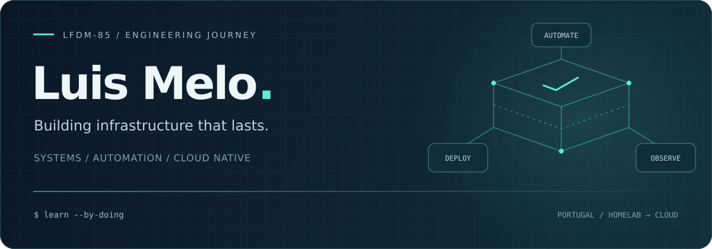
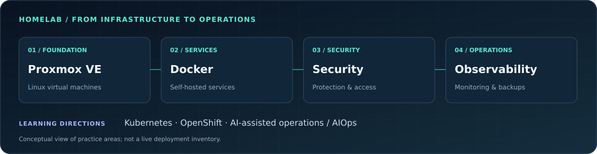

  

  <strong>Systems Administrator → DevOps · Exploring AI &amp; AIOps · Portugal</strong> 
  Linux foundations. Container platforms. Security-minded operations.

  <a href="https://www.linkedin.com/in/luisfdmelo/">Connect on LinkedIn ↗</a>
  &nbsp; · &nbsp;
  <a href="https://github.com/LFDM-85?tab=repositories">Explore my work ↗</a>
  &nbsp; · &nbsp;
  <a href="#my-semi-professional-homelab">Inside the homelab ↓</a>

## Systems thinking. Hands-on building.

I’m Luis, a systems administrator developing my DevOps practice through Linux, automation and container-based infrastructure. I like understanding the whole system: how services are deployed, how they communicate, how they are secured and how to diagnose them when something fails.

I run a **semi-professional homelab** as a practical environment for self-hosting, infrastructure experiments and operational learning. I’m also exploring **AI-assisted operations and AIOps**: bringing automation and operational context together, with verification and human oversight.

| Focus | What I’m working on |
| :--- | :--- |
| **Linux & systems** | Systems administration, troubleshooting, virtualisation and self-hosted services. |
| **DevOps & containers** | Repeatable workflows, Docker, automation and container orchestration. |
| **Security & reliability** | Access control, network protection, backups and service monitoring. |
| **AI & AIOps** | Exploring AI-assisted troubleshooting, operational knowledge and automation. |

## Selected work

**01 · [Observability Stack ↗](https://github.com/LFDM-85/observability-stack)** 
An observability workspace bringing together Prometheus, Grafana, Loki, Alloy and Alertmanager. 
METRICS / LOGS / ALERTING

**02 · [DevOps Lab ↗](https://github.com/LFDM-85/devops-lab)** 
A practical environment for Ansible automation, Docker services, Kubernetes experiments and CI/CD workflows. 
AUTOMATION / CONTAINERS / CI/CD

**03 · [ELK Stack ↗](https://github.com/LFDM-85/ELK)** 
A workspace for Elasticsearch, Logstash and Kibana: collecting, searching and exploring logs. 
LOG PIPELINES / SEARCH / VISIBILITY

**04 · [Omarchy Sync Mesh ↗](https://github.com/LFDM-85/omarchy-sync-mesh)** 
A Linux desktop synchronisation project, extending my systems interest beyond the server. 
LINUX / OMARCHY / SYNCHRONISATION

## My semi-professional homelab

  

My lab brings together **Proxmox VE, Linux virtual machines and Docker-based services**, with a focus on **security, reliability, backups and monitoring**. It is where I practise the full lifecycle: deploy, secure, observe, troubleshoot and improve.

The diagram shows areas of practice rather than a live network topology. **Kubernetes and OpenShift are learning directions**, not a claim that either currently runs in the homelab.

## Technology landscape

| Area | Tools & platforms |
| :--- | :--- |
| **Systems & virtualisation** | Linux · Debian · Proxmox VE |
| **Containers** | Docker · Compose · Kubernetes (developing practice) |
| **Automation** | Bash · Python · Ansible |
| **Networking & security** | Network security · Access control · OpenSSL |
| **Observability** | Prometheus · Grafana · Loki · Alloy · Alertmanager · Elastic Stack |
| **Exploration** | AI-assisted operations · AIOps · OpenShift |

## Next chapter

- **DevOps:** turn lab experiments into reproducible, documented workflows.
- **Cloud native:** deepen Kubernetes practice and explore OpenShift.
- **AIOps:** explore how AI can help interpret operational context and support troubleshooting.
- **Security:** keep improving access control, recovery procedures and visibility.

Working on Linux, Proxmox, containers or AI-assisted operations? [Let’s connect.](https://www.linkedin.com/in/luisfdmelo/)

  

